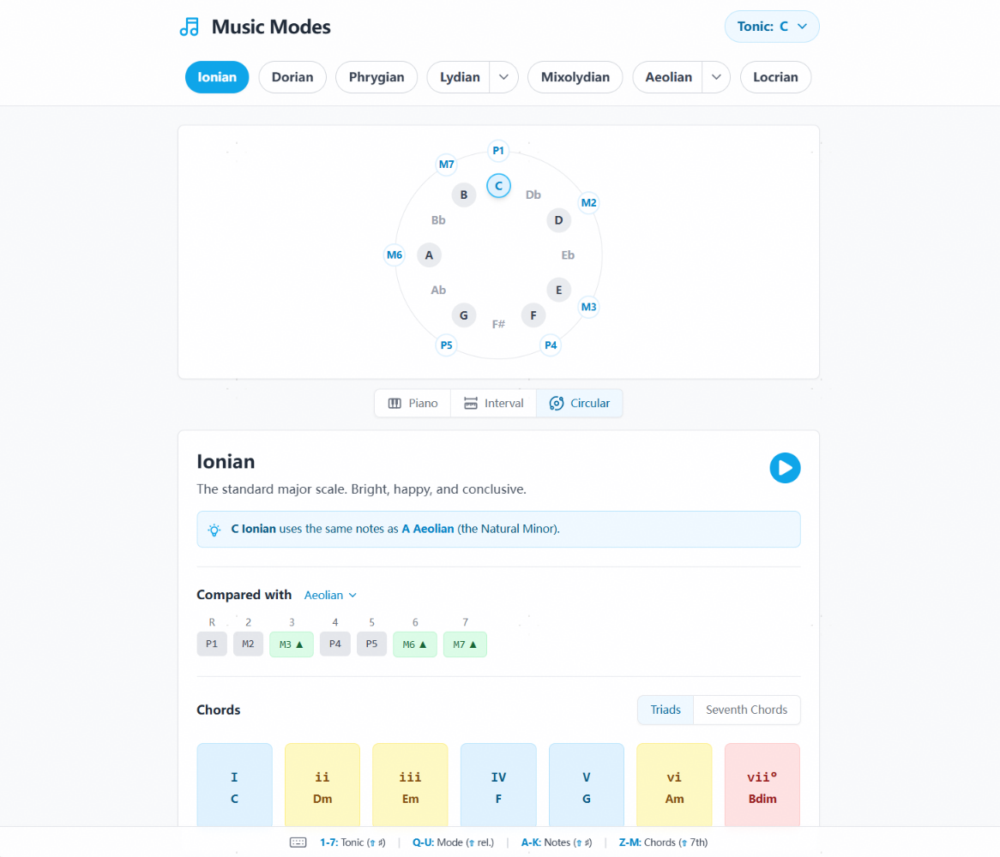

## Visualization of modes and scales

So this is a website I built while learning. You can easily switch between modes and see how intervals change between them. Since there is a shortcut for everything (scales, modes, notes, even chords), you can even experiment with modal mixture with your computer keyboard.

I built this main for fun. Hope some of you will find it useful.

(I'm not a native speaker, so sorry for my English.)
